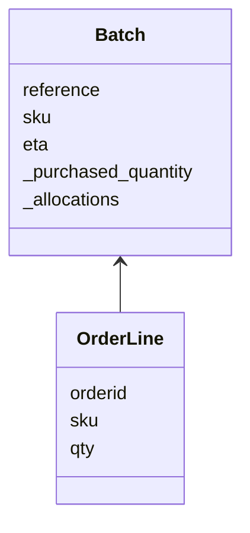

**저장소 패턴**

- 데이터 저장소를 더 간단히 추상화한 것
- 모델 계층과 데이터 계층을 분리하여 데이터 베이스의 복잡성을 감춤


> 출처: [Repository Pattern (cosmicpython.com)](https://www.cosmicpython.com/book/chapter_02_repository.html)

## 1. 도메인 모델 영속화 (Persisting Our Domain Model)

- 이전 장에서 작성한 도메인 모델은 테스트 하기 쉽지만, 점차 DB에 붙이고 API를 실행해야한다면 테스트와 유지보수하기가 어려워짐
- 앞으로 어떻게 이상적인 모델과 외부 상태를 연결하는 방법을 살펴봄
- 어떤 방식으로든 **영속적인 저장소, 즉 데이터베이스가 필요함**

## 2. 의사코드: 무엇이 필요할까?

- 간단한 Pseudo Code 작성
- OrderLine을 추출하여 DB에서 배치를 불러와야함, 그리고 다시 배치를 업데이트 해야함

```python
@flask.route.gubbins
def allocate_endpoint():
    # extract order line from request
    line = OrderLine(request.params, ...)
    # load all batches from the DB
    batches = ...
    # call our domain service
    allocate(line, batches)
    # then save the allocation back to the database somehow
    return 201
```

## 3. 데이터 접근에 DIP 적용하기

| 1. Layered Architecture              | 2. Onion Architecture                |
| ------------------------------------ | ------------------------------------ |
|  |  |

- 앞서 많이 본 계층 아키텍쳐에서 양파 아키텍쳐로의 변화는 도메인 모델 (가운데 계층)이 그 어떤 의존성도 가지지 않는 것을 목적으로 함
- 화살표가 의존성의 방향이라고 본다면 `Domain Model`에선 어떤 화살표도 나가지 않음, 다른 레이어가 Model에 의존하는 역전 관계
- django의 MVC 구조는 서로 간의 밀접한 관계를 맺고 있음


> [MVC - MDN Web Docs Glossary: Definitions of Web-related terms | MDN (mozilla.org)](https://developer.mozilla.org/en-US/docs/Glossary/MVC)

> 이러한 아키텍쳐가 꼭 포트와 어댑터 패턴, 헥사고날 아키텍쳐와 같은가? 거의 같은 개념이고 의존 관계의 역전이 중요한 포인트이다.
{: .prompt-info }

## 4. 기억 되살리기: 우리가 사용하는 모델



- 위와 같은 모델을 이제 예시로 사용해보자

### 4.1 '일반적인' ORM 방식: ORM에 의존하는 모델

- DB를 다룰 때 SQL를 직접 작성하는 방식 보다는 ORM을 이용함
- **ORM(Object-Relation Mapping) 객체 관계 매핑이라고 불리는 프레임워크로 객체(Object)를 SQL의 테이블(Relation)과 연결**을 시켜줘 편한 개발이 가능하게 함
- ORM이 제공하는 가장 중요한 기능: **영속성 무지(Persistent Ignorance)** 사용자는 DB가 어떻게 작동하는지 몰라도 된다!
- 기존 모델을 ORM으로 매핑한다면 아래와 같이 변환됨

```python
from sqlalchemy import Column, Integer, String, ForeignKey
from sqlalchemy.ext.declarative import declarative_base
from sqlalchemy.orm import relationship

Base = declarative_base()


class Order(Base):
    id = Column(Integer, primmary_key=True)

class OrderLine(Base):
    id = Column(Integer, primmary_key=True)
    sku = Column(String(250))
    qty = Column(String(250))
    order_id = Column(Integer, ForeignKey('order.id'))
    order = relationship(Order)

class Allocation(Base):
    id = Column(Integer, primmary_key=True)
    orderline_id = Column(Integer, ForeignKey('order_lines.id'))
    batch_id = Column(Integer, ForeignKey('batches.id'))

...
```

- 보면 알겠지만 과연 이게 편한가? 정말 데이터베이스에 무지하다고 할 수 있을까?
- 어떤 열에 연결되어 있는데 **어떻게 관심사 분리가 가능할까?**
  - **이러한 물음의 답이 아래 의존성 역전이다.**

### 4.2 의존성 역전: 모델에 의존하는 ORM

- 바로 스키마를 별도로 정의하고 스키마 - 도메인 모델을 상호 변환하는 매퍼를 활용
  - 이러한 맵퍼를 고전적 맵퍼라고 함
- 책에 있는 내용은 지금은 deprecated된 코드로 2.0에 맞는 코드로 변환이 필요
- [ORM Mapped Class Overview — SQLAlchemy 2.0 Documentation](https://docs.sqlalchemy.org/en/20/orm/mapping_styles.html#imperative-mapping)

> Changed in version 2.0: The [`registry.map_imperatively()`](https://docs.sqlalchemy.org/en/20/orm/mapping_api.html#sqlalchemy.orm.registry.map_imperatively "sqlalchemy.orm.registry.map_imperatively") method is now used to create classical mappings. The `sqlalchemy.orm.mapper()` standalone function is effectively removed.
{: .prompt-danger }

```python
from sqlalchemy import Table, MetaData, Column, Integer, String, Date, ForeignKey
from sqlalchemy.orm import registry, relationship

from src.architecture_python.chapter02.database import  model


metadata = MetaData()
mapper_registry = registry()

order_lines = Table(
    "order_lines",
    metadata,
    Column("id", Integer, primary_key=True, autoincrement=True),
    Column("sku", String(255)),
    Column("qty", Integer, nullable=False),
    Column("orderid", String(255)),
)

batches = Table(
    "batches",
    metadata,
    Column("id", Integer, primary_key=True, autoincrement=True),
    Column("reference", String(255)),
    Column("sku", String(255)),
    Column("_purchased_quantity", Integer, nullable=False),
    Column("eta", Date, nullable=True),
)

allocations = Table(
    "allocations",
    metadata,
    Column("id", Integer, primary_key=True, autoincrement=True),
    Column("orderline_id", ForeignKey("order_lines.id")),
    Column("batch_id", ForeignKey("batches.id")),
)


def start_mappers():
    lines_mapper = mapper_registry.map_imperatively(model.OrderLine, order_lines)
    mapper_registry.map_imperatively(
        model.Batch,
        batches,
        properties={
            "_allocations": relationship(
                lines_mapper, secondary=allocations, collection_class=set,
            )
        },
    )
    # Mapper가 마법처럼 Domain Model과 연결한다.

```

- 테스트를 통해 위 코드를 검증할 수 있음
- 코드를 통해 도메인 모델을 자유롭게 생성 및 요청할 수 있음, SQL에 대한 동작에서 자유로움

```python
from src.architecture_python.chapter02.database import model
from datetime import date
from sqlalchemy.sql import text
import logging

logger = logging.getLogger()


def test_orderline_mapper_can_load_lines(session):
    session.execute(text(
        "INSERT INTO order_lines (orderid, sku, qty) VALUES "
        '("order1", "RED-CHAIR", 12),'
        '("order1", "RED-TABLE", 13),'
        '("order2", "BLUE-LIPSTICK", 14)'
    ))
    expected = [
        model.OrderLine("order1", "RED-CHAIR", 12),
        model.OrderLine("order1", "RED-TABLE", 13),
        model.OrderLine("order2", "BLUE-LIPSTICK", 14),
    ]
    assert session.query(model.OrderLine).all() == expected


def test_orderline_mapper_can_save_lines(session):
    new_line = model.OrderLine("order1", "DECORATIVE-WIDGET", 12)
    session.add(new_line)
    session.commit()

    rows = list(session.execute(text('SELECT orderid, sku, qty FROM "order_lines"')))
    assert rows == [("order1", "DECORATIVE-WIDGET", 12)]
```

```shell
============================================================ test session starts =============================================================
platform darwin -- Python 3.10.13, pytest-8.1.1, pluggy-1.4.0 -- /Users/user/Library/Caches/pypoetry/virtualenvs/architecture-python-XYM1j5R_-py3.10/bin/python
cachedir: .pytest_cache
rootdir: /Users/user/personal/architecture-python
configfile: pyproject.toml
plugins: anyio-4.3.0, cov-4.1.0
collected 2 items                                                                                                                            

tests/chapter02/test_orm.py::test_orderline_mapper_can_load_lines PASSED                                                               [ 50%]
tests/chapter02/test_orm.py::test_orderline_mapper_can_save_lines PASSED                                                               [100%]

============================================================= 2 passed in 0.02s =============================================================
```

- 

## 5. 저장소 패턴 소개

- **저장소 패턴**: 영속적 저장소를 추상화한 것, 모든 데이터가 메모리 상에 존재하는 것처럼 가정해 데이터 접근과 관련된 세부사항을 감춤

```python
import all_my_data

def create_a_batch():
    batch = Batch(...)
    all_my_data.batches.add(batch)

def modify_a_batch(batch_id, new_quantity):
    batch = all_my_data.batches.get(batch_id)
    batch.change_initial_quantity(new_quantity)
```

- 메모리 상에서 존재한다는 가정으로 수정시 따로 save() 할 필요가 없음

### 5.1 추상화한 저장소

- 가장 간단한 추상 저장소를 설계하면  `add()` 와 `get()` 이 존재해야함

```python
class AbstractRepository(abc.ABC):
    @abc.abstractmethod  #(1)
    def add(self, batch: model.Batch):
        raise NotImplementedError  #(2)

    @abc.abstractmethod
    def get(self, reference) -> model.Batch:
        raise NotImplementedError
```

> 여기선 추상 기반 클래스 (Abstract Base Classes)로 했지만 실무에선 무시하기가 너무 쉽다보니 잘 사용하지 않거나 더 복잡해지는 경우가 있음.
> 그래서 덕 타이핑에 의존하거나 PEP544 프로토콜이 대안이 될 수 있다. 상속보다 조합(Composition)이 좋다면 생각해볼만한 옵션
> [PEP 544 – Protocols: Structural subtyping (static duck typing) | peps.python.org](https://peps.python.org/pep-0544/)
{: .prompt-info }

### 5.2 트레이드 오프란 무엇인가?

- **항상 필요한 질문: 패턴 선택의 이득과 대가는 무엇인가?**
- 추상화로 전체적인 복잡성은 낮아지겠지만 지역적인 복잡성은 증가시킴
- DDD와 의존성 역전에서 저장소 패턴이 가장 채택하기 쉬움 -> 장점이 명확하기 때문
  - 저장소 계층을 간단하게 추상화할 수 있음
  - 추상화를 제어할 수 있음
  - 오브젝트 저장을 더 쉽고 유연하게 할 수 있음
  - 단위 테스트시 Fake를 쉽게 제공할 수 있음


>  출처: [Repository Pattern (cosmicpython.com)](https://www.cosmicpython.com/book/chapter_02_repository.html#_what_is_the_trade_off)

- 테스트 코드로 위에서 만든 Repository를 검증함

```python
from src.architecture_python.chapter02.database import model
from src.architecture_python.chapter02.database import repository

from sqlalchemy.sql import text

def test_repository_can_save_a_batch(session):
    batch = model.Batch("batch1", "RUSTY-SOAPDISH", 100, eta=None)

    repo = repository.SqlAlchemyRepository(session)
    repo.add(batch)
    session.commit()

    rows = session.execute(
        text('SELECT reference, sku, _purchased_quantity, eta FROM "batches"')
    )
    assert list(rows) == [("batch1", "RUSTY-SOAPDISH", 100, None)]


def insert_order_line(session):
    session.execute(
        text("INSERT INTO order_lines (orderid, sku, qty)"
        ' VALUES ("order1", "GENERIC-SOFA", 12)')
    )
    [[orderline_id]] = session.execute(
        text("SELECT id FROM order_lines WHERE orderid=:orderid AND sku=:sku"),
        dict(orderid="order1", sku="GENERIC-SOFA"),
    )
    return orderline_id


def insert_batch(session, batch_id):
    session.execute(
        text("INSERT INTO batches (reference, sku, _purchased_quantity, eta)"
        ' VALUES (:batch_id, "GENERIC-SOFA", 100, null)'),
        dict(batch_id=batch_id),
    )
    [[batch_id]] = session.execute(
        text('SELECT id FROM batches WHERE reference=:batch_id AND sku="GENERIC-SOFA"'),
        dict(batch_id=batch_id),
    )
    return batch_id


def insert_allocation(session, orderline_id, batch_id):
    session.execute(
        text("INSERT INTO allocations (orderline_id, batch_id)"
        " VALUES (:orderline_id, :batch_id)"),
        dict(orderline_id=orderline_id, batch_id=batch_id),
    )


def test_repository_can_retrieve_a_batch_with_allocations(session):
    orderline_id = insert_order_line(session)
    batch1_id = insert_batch(session, "batch1")
    insert_batch(session, "batch2")
    insert_allocation(session, orderline_id, batch1_id)

    repo = repository.SqlAlchemyRepository(session)
    retrieved = repo.get("batch1")

    expected = model.Batch("batch1", "GENERIC-SOFA", 100, eta=None)
    assert retrieved == expected  # Batch.__eq__ only compares reference
    assert retrieved.sku == expected.sku
    assert retrieved._purchased_quantity == expected._purchased_quantity
    assert retrieved._allocations == {
        model.OrderLine("order1", "GENERIC-SOFA", 12),
    }

```


## 6. 테스트에 사용하는 가짜 저장소를 쉽게 만드는 방법

## 7. 파이썬에서 포트와 어댑터란 무엇인가

-

## 8. 마치며

| 장점                                                               | 단점                                                   |
| ---------------------------------------------------------------- | :--------------------------------------------------- |
| DB와 도메인 모델 사이의 인터페이스를 간단하게 유지                                    | ORM이 이미 어느정도 결합을 완화시켜줌. MySQL <-> Postgres 정도 전환은 가능 |
| 모델과 인프라를 완전히 분리하여 단위 테스트를 위한 Fake Repository를 쉽게 생성 가능           | 수동 ORM 매핑은 공수가 더 필요                                  |
| 영속성 보다 도메인에 더 집중할 수 있음. 접근 방식을 극적으로 바꿀 때 DB 관련 사항을 염려하지 않고 반영 가능 | 간접 계층을 추가하면 결국 유지보수 비용이 증가                           |
| 객체를 테이블에 매핑하는 과정에서 원하는 대로 제어 가능하여 DB 스키마를 단순화할 수 있음              |                                                      |
> 앱이 래퍼를 감싸는(?) 단순한 CRUD라면 도메인 모델이나 저장소가 필요로 하지 않음

위와 같은 트레이드 오프를 생각해야하고 복잡성이 낮다면 ORM, 액티브레코드 패턴이 나을 수 있지만, 더 복잡하게 갈 수록 두 패턴보다는 복잡하지만 추후 유지보수성이 좋고 인프라에 대해 유연한 저장소 패턴도 좋은 선택이 될 수 있다.
