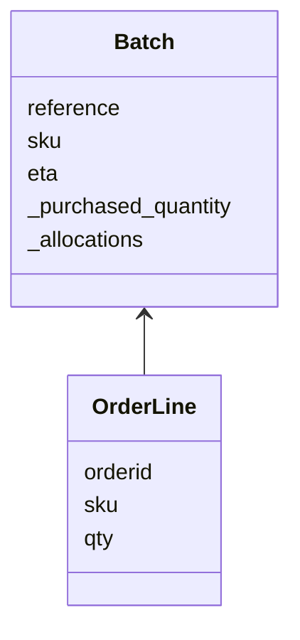

**저장소 패턴**
- 데이터 저장소를 더 간단히 추상화한 것
- 모델 계층과 데이터 계층을 분리하여 데이터 베이스의 복잡성을 감춤


> 출처: [Repository Pattern (cosmicpython.com)](https://www.cosmicpython.com/book/chapter_02_repository.html)

## 1. 도메인 모델 영속화 (Persisting Our Domain Model)
- 이전 장에서 작성한 도메인 모델은 테스트 하기 쉽지만, 점차 DB에 붙이고 API를 실행해야한다면 테스트와 유지보수하기가 어려워짐
- 앞으로 어떻게 이상적인 모델과 외부 상태를 연결하는 방법을 살펴봄
- 어떤 방식으로든 **영속적인 저장소, 즉 데이터베이스가 필요함**

## 2. 의사코드: 무엇이 필요할까?
- 간단한 Pseudo Code 작성
- OrderLine을 추출하여 DB에서 배치를 불러와야함, 그리고 다시 배치를 업데이트 해야함
```python
@flask.route.gubbins
def allocate_endpoint():
    # extract order line from request
    line = OrderLine(request.params, ...)
    # load all batches from the DB
    batches = ...
    # call our domain service
    allocate(line, batches)
    # then save the allocation back to the database somehow
    return 201
```

## 3. 데이터 접근에 DIP 적용하기

| 1. Layered Architecture              | 2. Onion Architecture                |
| ------------------------------------ | ------------------------------------ |
|  |  |
- 앞서 많이 본 계층 아키텍쳐에서 양파 아키텍쳐로의 변화는 도메인 모델 (가운데 계층)이 그 어떤 의존성도 가지지 않는 것을 목적으로 함
- 화살표가 의존성의 방향이라고 본다면 `Domain Model`에선 어떤 화살표도 나가지 않음, 다른 레이어가 Model에 의존하는 역전 관계
- django의 MVC 구조는 서로 간의 밀접한 관계를 맺고 있음

> [MVC - MDN Web Docs Glossary: Definitions of Web-related terms | MDN (mozilla.org)](https://developer.mozilla.org/en-US/docs/Glossary/MVC)


> 이러한 아키텍쳐가 꼭 포트와 어댑터 패턴, 헥사고날 아키텍쳐와 같은가? 거의 같은 개념이고 의존 관계의 역전이 중요한 포인트이다. {: .prompt-info }

## 4. 기억 되살리기: 우리가 사용하는 모델


- 위와 같은 모델을 이제 예시로 사용해보자

### 4.1 '일반적인' ORM 방식: ORM에 의존하는 모델

- DB를 다룰 때 SQL를 직접 작성하는 방식 보다는 ORM을 이용함
- **ORM(Object-Relation Mapping) 객체 관계 매핑이라고 불리는 프레임워크로 객체(Object)를 SQL의 테이블(Relation)과 연결**을 시켜줘 편한 개발이 가능하게 함
- ORM이 제공하는 가장 중요한 기능: **영속성 무지(Persistent Ignorance)** 사용자는 DB가 어떻게 작동하는지 몰라도 된다!
- 기존 모델을 ORM으로 매핑한다면 아래와 같이 변환됨

```python
from sqlalchemy import Column, Integer, String, ForeignKey
from sqlalchemy.ext.declarative import declarative_base
from sqlalchemy.orm import relationship

Base = declarative_base()


class Order(Base):
    id = Column(Integer, primmary_key=True)

class OrderLine(Base):
    id = Column(Integer, primmary_key=True)
    sku = Column(String(250))
    qty = Column(String(250))
    order_id = Column(Integer, ForeignKey('order.id'))
    order = relationship(Order)

class Allocation(Base):
    id = Column(Integer, primmary_key=True)
    orderline_id = Column(Integer, ForeignKey('order_lines.id'))
    batch_id = Column(Integer, ForeignKey('batches.id'))

...
```

- 보면 알겠지만 과연 이게 편한가? 정말 데이터베이스에 무지하다고 할 수 있을까?
- 어떤 열에 연결되어 있는데 **어떻게 관심사 분리가 가능할까?**
	- **이러한 물음의 답이 아래 의존성 역전이다.**

### 4.2 의존성 역전: 모델에 의존하는 ORM

- 

```python
from sqlalchemy import Table, MetaData, Column, Integer, String, Date, ForeignKey
from sqlalchemy.orm import registry, relationship

from src.architecture_python.chapter02.database import  model


metadata = MetaData()
mapper_registry = registry()

order_lines = Table(
    "order_lines",
    metadata,
    Column("id", Integer, primary_key=True, autoincrement=True),
    Column("sku", String(255)),
    Column("qty", Integer, nullable=False),
    Column("orderid", String(255)),
)

batches = Table(
    "batches",
    metadata,
    Column("id", Integer, primary_key=True, autoincrement=True),
    Column("reference", String(255)),
    Column("sku", String(255)),
    Column("_purchased_quantity", Integer, nullable=False),
    Column("eta", Date, nullable=True),
)

allocations = Table(
    "allocations",
    metadata,
    Column("id", Integer, primary_key=True, autoincrement=True),
    Column("orderline_id", ForeignKey("order_lines.id")),
    Column("batch_id", ForeignKey("batches.id")),
)


def start_mappers():
    lines_mapper = mapper_registry.map_imperatively(model.OrderLine, order_lines)
    mapper_registry.map_imperatively(
        model.Batch,
        batches,
        properties={
            "_allocations": relationship(
                lines_mapper, secondary=allocations, collection_class=set,
            )
        },
    )

```


## 5. 저장소 패턴 소개


### 5.1 추상화한 저장소

### 5.2 트레이드 오프란 무엇인가?


## 6. 테스트에 사용하는 가짜 저장소를 쉽게 만드는 방법


## 7. 파이썬에서 포트와 어댑터란 무엇인가


## 8. 마치며


| 장점  | 단점  |
| --- | :-- |
|     |     |
|     |     |
|     |     |
